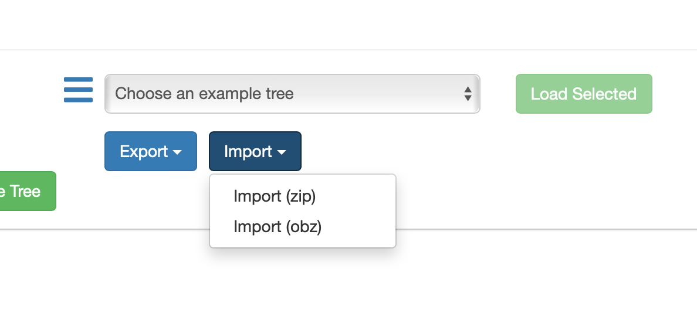

# Editing the tree

[[toc]]

## Quick Edit method 

### Editing

1. Tap on the edit button 


2. Using the navigation menu - navigate to the node you want to edit

So tap down to go down - right - to go into a sub tree element.

3. Edit the text in the node. 

Note that if you put text in brackets after the word  - this will be the cue text. Other text is read out loud as the main text. 

4. Hit save when done

Here is a quick video demonstrating this:

<iframe width="560" height="315" src="https://www.youtube.com/embed/c-0KMfAbvDE" frameborder="0" allow="accelerometer; autoplay; encrypted-media; gyroscope; picture-in-picture" allowfullscreen></iframe>


### Adding and removing elements


1. Tap on the edit button 


2. Using the navigation menu - navigate to the part where you want to add a new element - or list of elements

So tap down to go down - right - to go into a sub tree element.

3. Use the Green Plus or Red Minus icons to add or remove elements 

So pressing a **plus** above the selected element will add a new element above, pressing it below will add an item below - and right - will add a new sub-element. 

Equally removing an item is easy by pressing the delete button. 

::: warning
There is no **revert** or undo! Be careful with the delete tool!
:::

4. Hit save when done

Here is a quick video demonstrating this:

<iframe width="560" height="315" src="https://www.youtube.com/embed/P86Y2Izp_Lc" frameborder="0" allow="accelerometer; autoplay; encrypted-media; gyroscope; picture-in-picture" allowfullscreen></iframe>


### Adding or removing audio recordings

With the quick edit mode you can also add or remove audio recordings. Pasco is unique in that you can have an audio recording for the cue - and main item. 

## Text file - in settings method

The "vocabulary" for pasco is stored as a text file. You can read - and write this text file in a number of applications outside of pasco. We use our own internal format for this - but its based on a text file format used across the internet called [Markdown](https://en.wikipedia.org/wiki/Markdown). The app supports "ATX" style and standard markdown lists formats. 

For example. This is a standard layout:

```markdown
- My phrases
	- Hello
	- Goodbye
	- Thanks
	- No thanks
	- Questions
		- How are you?
		- What are you doing today?
```

::: warning
Be super careful with the use of tabs - and spaces. The lines **have** to have the right spacing to be read by pasco correctly. You can use tabs - or spaces but to make your life easier - try and use the same throughout. Confused? [Read this tip](/tips-n-tricks/editing-with-texteditor.html) on how to do this correctly!
:::

ATX formats use 1-6 hash characters at the start of the line, corresponding to header levels 1-6. For example this is the same vocabulary file using ATX style headings:


```
# My phrases

## Hello

## Goodbye

## Thanks

## No thanks

## Questions

### How are you?

### What are you doing today?
```


::: tip Background on the markdown format we use
Pasco's language file is based on markdown - and the work by others who use markdown for mindmaps. See [https://brettterpstra.com/2013/08/18/markdown-to-mind-map/](https://brettterpstra.com/2013/08/18/markdown-to-mind-map) for where this inspiration came from
:::

::: tip
A nice and simple way of making pasco trees is to use a mindmap editor that exports in this markdown format. We have some details on how to do this using an app called mindnode [here](/tips-n-tricks/editing-with-mindnode.html). 
::: 

As well as the basic format - we use some basic formatting tricks: 

- *Cue message.*
The main message is the first item. The cue is anything in brackets. e.g. ```My phrases (phrases)``` will say "My Phrases" out loud but give the cue as "phrases"
- *Meta-data commands*. We can add additional functionality, for example a way of switching which is the current active tree, using a recorded audio file - or controlling a internet enabled device such as a light switch - using these commands. e.g. ```Go Back <meta data-back-n-branch="1"> ``` will control pasco to go back a level. For more information on all the commands you can use please read the [documentation here](/advanced/meta-tags.html#overview). 

You can either edit the text file directly in the app (go to **Settings -> Vocabulary -> Edit Tree**) - or in a seperate text file app and then paste it into this text area. A video demonstrating the two approaches is seen below.

<iframe width="560" height="315" src="https://www.youtube.com/embed/igMLAqR9Mvg" frameborder="0" allow="accelerometer; autoplay; encrypted-media; gyroscope; picture-in-picture" allowfullscreen></iframe>

## Importing from other AAC programs

As well as having its own vocabulary format, Pasco supports an open standard of vocabulary called the **Open Board format**. More information on this format can be seen [here](http://openboardformat.org). Apps that support the format can be seen [here](https://www.openboardformat.org/partners). 

To import OBZ formats - select the Import tool found at **Settings -> Vocabulary -> Tools -> Import** to import your format. 



