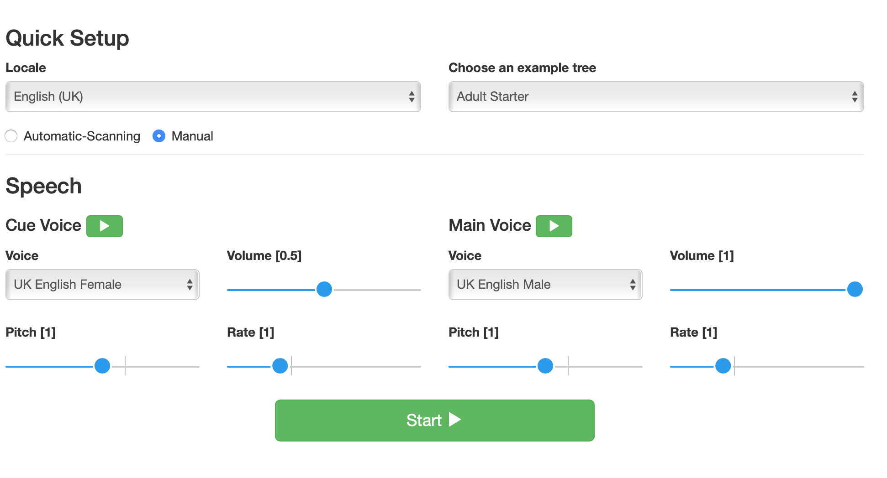
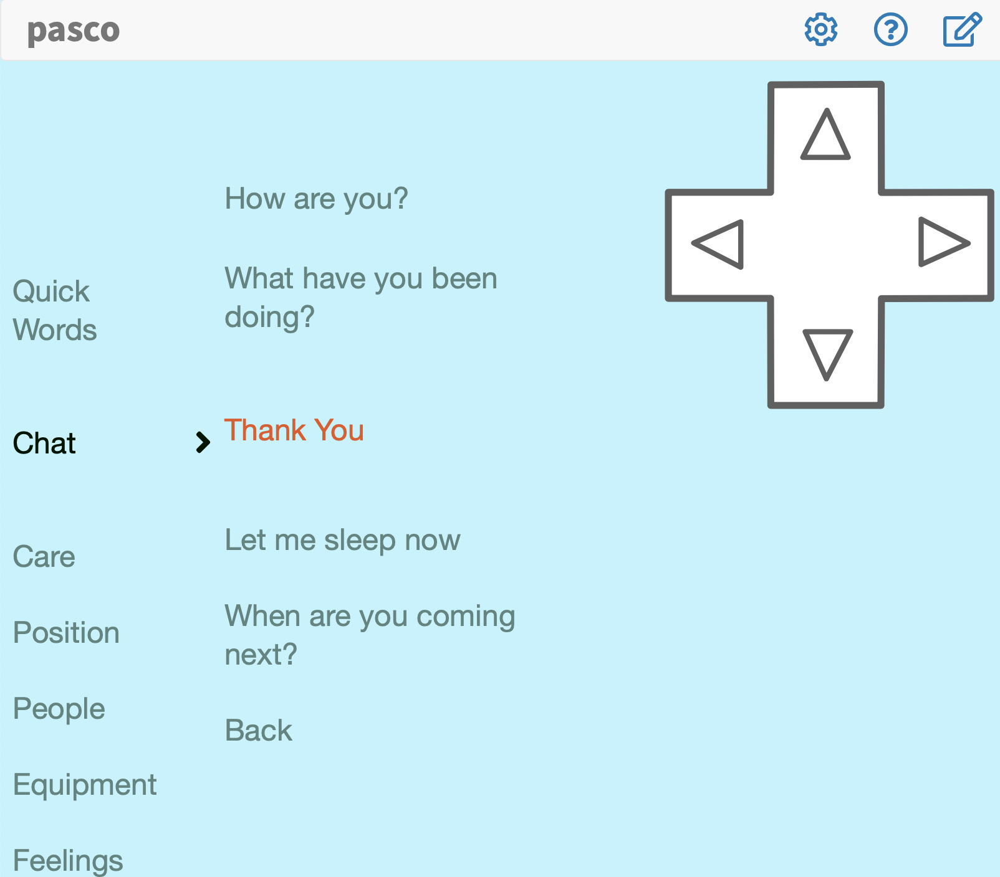

# ⚙️ Installation

> The easiest way to get up-and-running is with the [iOS app](https://itunes.apple.com/us/app/pasco/id1317265884?ls=1&mt=8), as it has all the features available. Alternatively have a play with the version online [here](http://app.pasco.chat) - just note features like splitting the audio channels or recording sound recordings aren't supported. 

## What platforms are supported?

pasco is a web app currently. This is great as we can support a range of platforms and develop ideas relatively quickly. The downside though is that some features that rely on the operating system need to still be developed specifically. So here are the features and quick overview that which features work where:

| Feature        | iOS           | Web  |
| ------------------------------------------------------------ |:----:| ----:|
| Cue / Main voice splitting between headphone and speaker     | ✅   |  ❎  |
| Import/Export of Vocab tree                                  | ✅   |  ✅  |
| Offline support                                              | ✅   |  ✅  |
| In-App Editing                                               | ✅   |  ✅  |
| In-App Voice Recording                                       | ✅   |  ❎  |
| Adjustable font size and Colour Themes                       | ✅   |  ✅   |
| Switch Access (1-4)					                       | ✅   |  ✅   |
| On-Screen navigation tool, Resizable and Draggable           | ✅   |  ✅   |

## Device requirements

So for the full-feature verison of pasco look at using it on a iOS device (iPhone, iPod Touch, iPad). 

### Switch interface 

If you need switch scanning you will also need a compatible switch interface. Pasco is designed to work natively with switch interface boxes that support space and enter - or arrow keys. This includes: [Pretorian Applicator and iSwitch](https://www.pretorianuk.com/assistive-technology-for-ipad), [Origin Instruments Tapio](http://www.orin.com/access/tapio/), [Ablenet's Blue2 switch](https://www.ablenetinc.com/technology/computer-tablet-access/blue2-bluetooth-switch) and the [Tecla](https://gettecla.com). For all these switch interfaces you need to put it into a mode that supports pressing 'space' and 'enter' keys. 

You can use other switch interfaces designed to work purely with Apple's own switch scanning system such as the [hook+](https://www.ablenetinc.com/downloads/dl/file/id/663/product/515/hook_product_info.pdf). Using these gives you the advantage of being able to use the entire device for scanning - and pasco's own features - **BUT** you need to be aware of how to create a switch recipe and the user having the ability of changing to this recipe when they are ready. Follow [this guide if you wish to do this](/tips-n-tricks/ios-switch-scanning.html). 

### Speakers / Headphones for cue / main 

If you wish to use a second speaker - we recommend right now to use a wired headphone - and just the device's own internal speaker. 

::: tip 
Want a nice simple speaker that you can put in the headrest of a chair? Look for ['Pillow' speakers](https://www.amazon.co.uk/s?k=pillow+speaker&ref=nb_sb_noss_1)
:::

## Setup

When you first load pasco you will see a quick setup screen. It should look a little like this

::: warning 
Depending on which device you are using these screens may look slightly different - and depending on whether you have your screen in potrtait or landscape. But all the same options should be available. 
:::

### What do all these options mean? 

For a full guide on all of the configuration options [read this guide](/tips-n-tricks/configuration-options.html). The options seen on this screen are seen below:

* **locale** Which language are you wanting the app to be setup in? Changing this will change the language of all the menu items and configuration buttons.  
* **Choose an example tree** "Trees" are what other communication apps call "Pagesets" or "Gridsets" or similar. We call them "Trees" in pasco because it defines how language is navigated - like an ever expanding network of branches. Here we have some example trees to get you started. Choose one to see some examples of pasco. 
* **Automatic Scanning or Manual**. Choose **Manual** if you want to try it out without a switch - or if you wish to try it with two or more switches. If you want to use it with one switch select **Automatic scanning**. When you do this, make sure your switch is set to **Enter** 
* **Cue Voice** is the voice to hear the auditory cue. Typically a user may hear what they can select right now with a cue (sometimes called **Private voice**). You can choose the voice, the rate, pitch and volume of this voice. You can try an example of the settings by pressing the **Green play** button
* **Main Voice** is the voice that others will hear - typically the communication partner. Sometimes people amplify this using a secondary speaker. In other software this has typically been called the **Public Voice**. 

## Play/**Start** screen 

Once you have pressed the Green "Start" button at the bottom of the quick setup screen - or you click on the small "Play" icon anywhere else in the app you should see a screen a little like this below. 

The screen has two main components. The grey **navigation bar** at the top where you can access "Configuration", "Help" and "Edit" options, and the main **language display** area. 

 

---

👍 You've successfully installed and setup pasco!

😞 Got a problem? Dang! See our [troubleshooting](/getting-started/contributing.md) guide. 
